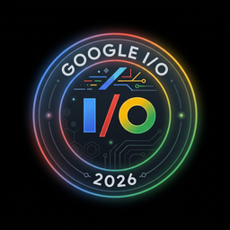

<!-- HEADER — WAVING BANNER -->

---

&nbsp;

&nbsp;

&nbsp;

&nbsp;

&nbsp;

&nbsp;

---

<h2 align="center">🚀 About Me</h2>

<table align="center">
<tr>
<td valign="top" width="55%">

Hey there! I'm **Satyam Chandra**, aka **C0DER-B0T** — a passionate **AI/ML Engineer & Data Scientist** from India who lives and breathes intelligent systems.

- 🔭 Currently building **cutting-edge AI projects** that blend research with real-world impact
- 🤝 Looking to collaborate on **open-source AI tools** & **innovative ML ideas**
- 🌱 Deep-diving into **Generative AI**, **Agentic Systems**, **RAG Pipelines**, and **Scalable ML**
- 💬 Ask me about **Machine Learning, Deep Learning, Computer Vision, NLP** or **MCP Servers**
- 🎓 Certified by **Anthropic, IIT Roorkee, IIT Guwahati, Microsoft, LinkedIn**
- ⚡ Fun fact: I love **breaking models just to rebuild them smarter**

</td>
<td align="center" width="45%">

</td>
</tr>
</table>

 

<table>
  <tr>
    <td align="center" valign="middle" width="35%">
      
    </td>
    <td align="center" valign="middle" width="65%">
      
    </td>
  </tr>
</table>

---

<h2 align="center">⚙️ My Favorite Tools & Technologies</h2>

> Tools and technologies that I have worked with and am deeply passionate about

<h3 align="center">🧠 AI / ML Core Stack</h3>

<table>
  <tr>
    <td align="center" width="96">
      
       Python
    </td>
    <td align="center" width="96">
      
       TensorFlow
    </td>
    <td align="center" width="96">
      
       PyTorch
    </td>
    <td align="center" width="96">
      
       Scikit-learn
    </td>
    <td align="center" width="96">
      
       NumPy
    </td>
    <td align="center" width="96">
      
       Pandas
    </td>
    <td align="center" width="96">
      
       OpenCV
    </td>
    <td align="center" width="96">
      
       HuggingFace
    </td>
  </tr>
  <tr>
    <td align="center" width="96">
      
       LangChain
    </td>
    <td align="center" width="96">
      
       Streamlit
    </td>
    <td align="center" width="96">
      
       ChatGPT
    </td>
    <td align="center" width="96">
      
       Claude API
    </td>
    <td align="center" width="96">
      
       Gemini
    </td>
    <td align="center" width="96">
      
       Ollama
    </td>
    <td align="center" width="96">
      
       Meta Llama
    </td>
    <td align="center" width="96">
      
       YOLOv8
    </td>
  </tr>
</table>

<h3 align="center">☁️ Cloud, DevOps & Deployment</h3>

<table>
  <tr>
    <td align="center" width="96">
      
       AWS
    </td>
    <td align="center" width="96">
      
       Docker
    </td>
    <td align="center" width="96">
      
       GitHub
    </td>
    <td align="center" width="96">
      
       Firebase
    </td>
    <td align="center" width="96">
      
       Vercel
    </td>
    <td align="center" width="96">
      
       Linux
    </td>
    <td align="center" width="96">
      
       Git
    </td>
    <td align="center" width="96">
      
       Oracle Cloud
    </td>
  </tr>
</table>

<h3 align="center">🗄️ Databases & Backend</h3>

<table>
  <tr>
    <td align="center" width="96">
      
       MongoDB
    </td>
    <td align="center" width="96">
      
       PostgreSQL
    </td>
    <td align="center" width="96">
      
       MySQL
    </td>
    <td align="center" width="96">
      
       REST API
    </td>
    <td align="center" width="96">
      
       FastAPI
    </td>
    <td align="center" width="96">
      
       Django
    </td>
    <td align="center" width="96">
      
       Flask
    </td>
  </tr>
</table>

<h3 align="center">💻 Programming Languages & Tools</h3>

<table>
  <tr>
    <td align="center" width="96">
      
       C
    </td>
    <td align="center" width="96">
      
       BASH
    </td>
    <td align="center" width="96">
      
       HTML
    </td>
    <td align="center" width="96">
      
       CSS
    </td>
    <td align="center" width="96">
      
       React
    </td>
    <td align="center" width="96">
      
       Node.js
    </td>
    <td align="center" width="96">
      
       LaTeX
    </td>
  </tr>
</table>

---

<h2 align="center">📊 GitHub Stats & Activity</h2>

  

  
  

  
  

  

  

  
<strong>📈 Activity Graph</strong>

   

  
<strong>🟩 Contribution Heat Map</strong>

   
  

---

<h2 align="center">🏆 GitHub Profile Trophy</h2>

  

---

<h2 align="center">🎖️ GitHub Achievements & Badges</h2>

<table style="width:100%; table-layout:fixed;">
  <colgroup>
    <col style="width:16.66%">
    <col style="width:16.66%">
    <col style="width:16.66%">
    <col style="width:16.66%">
    <col style="width:16.66%">
    <col style="width:16.66%">
  </colgroup>
  <tr>
    <td align="center">
      
       <strong>Galaxy Brain</strong>
       <em>Answered discussions</em>
    </td>
    <td align="center">
      
       <strong>Pull Shark</strong>
       <em>Merged pull requests</em>
    </td>
    <td align="center">
      
       <strong>Starstruck</strong>
       <em>Starred repository</em>
    </td>
    <td align="center">
      
       <strong>Pair Extraordinaire</strong>
       <em>Co-authored commits</em>
    </td>
    <td align="center">
      
       <strong>Quickdraw</strong>
       <em>Gitty up!</em>
    </td>
    <td align="center">
      
       <strong>YOLO</strong>
       <em>You want it? Merge it.</em>
    </td>
  </tr>
  <tr>
    <td align="center">
      
       <strong>GEAR Badge</strong>
       <em>Gemini Enterprise Agent Ready</em>
    </td>
    <td align="center">
      
       <strong>Google Developer</strong>
       <em>Joined Google Dev Program</em>
    </td>
    <td align="center">
      
       <strong>GCP & NVIDIA</strong>
       <em>Community Member</em>
    </td>
    <td align="center">
      
       <strong>Google I/O 2026</strong>
       <em>Registered Participant</em>
    </td>
    <td align="center">
      
       <strong>GDG on Campus</strong>
       <em>Member - UPES Dehradun</em>
    </td>
    <td align="center">
      
       <strong>Early Bird</strong>
       <em>Pegasaurus Badge</em>
    </td>
  </tr>
  <tr>
    <td align="center">
      
       <strong>Computer Vision</strong>
       <em>Microsoft Azure</em>
    </td>
    <td align="center">
      
       <strong>Deep Learning</strong>
       <em>Azure Databricks</em>
    </td>
    <td align="center">
      
       <strong>Train & Evaluate</strong>
       <em>Deep Learning Models</em>
    </td>
    <td align="center">
      
       <strong>DevTools Admin</strong>
       <em>Chrome Expert</em>
    </td>
    <td align="center">
      
       <strong>Azure ML</strong>
       <em>Workspace Resources</em>
    </td>
    <td align="center">
      
       <strong>GDG Discovery</strong>
       <em>Google Dev Group</em>
    </td>
  </tr>
</table>

---

<h2 align="center">🎓 Certifications & Courses</h2>

<table style="width:100%; table-layout:fixed;">
  <colgroup>
    <col style="width:20%"><col style="width:20%"><col style="width:20%"><col style="width:20%"><col style="width:20%">
  </colgroup>
  <tr>
    <td align="center">
      
       <strong>CSE [AI / ML]</strong>
       IIT Roorkee
       <em>Superior Level</em>
    </td>
    <td align="center">
      
       <strong>Data Science & AI</strong>
       IIT Roorkee (E&ICT)
       <em>Superior Level</em>
    </td>
    <td align="center">
      
       <strong>Claude with Vertex AI</strong>
       Anthropic
       <em>Advanced Level</em>
    </td>
    <td align="center">
      
       <strong>MCP Advanced Topics</strong>
       Anthropic
       <em>Advanced Level</em>
    </td>
    <td align="center">
      
       <strong>MachineLearning.AI 2025</strong>
       IIT Guwahati (AI Club)
       <em>Advanced Level</em>
    </td>
  </tr>
  <tr>
    <td align="center">
      
       <strong>Advanced Generative AI</strong>
       LinkedIn / NASBA
       <em>Advanced Level</em>
    </td>
    <td align="center">
      
       <strong>Advance Linux Training</strong>
       Intellipaat
       <em>Advanced Level</em>
    </td>
    <td align="center">
      
       <strong>Intro to MCP</strong>
       Anthropic
       <em>Basic Level</em>
    </td>
    <td align="center">
      
       <strong>What is Gen-AI</strong>
       LinkedIn
       <em>Medium Level</em>
    </td>
    <td align="center">
      
       <strong>Agent Skills</strong>
       Anthropic
       <em>Basic Level</em>
    </td>
  </tr>
  <tr>
    <td align="center">
      
       <strong>Agentic AI Skill Up</strong>
       GeeksforGeeks
       <em>Medium Level</em>
    </td>
    <td align="center">
      
       <strong>Git Skill Up</strong>
       GeeksforGeeks
       <em>Medium Level</em>
    </td>
    <td align="center">
      
       <strong>ML Internship</strong>
       Kodbud (AICTE) - April 2026
       <em>Medium Level</em>
    </td>
    <td align="center">
      
       <strong>Zero to AI Tester</strong>
       GeeksforGeeks
       <em>Basic Level</em>
    </td>
    <td align="center">
      
       <strong>More Incoming...</strong>
       Stay Tuned!
       <em>Always Learning</em>
    </td>
  </tr>
</table>

---

<h2 align="center">🚀 Featured Projects</h2>

<table>
  <tr>
    <td align="center" width="300">
      
       <strong>🚗 Number Plate Recogniser</strong>
       YOLOv8 - 100% accuracy on Indian plates
       <code>Python</code> <code>YOLOv8</code> <code>OpenCV</code>
       <a href="https://github.com/C0DER-B0T/Number-Plate-Recognizer">🔗 GitHub</a>
    </td>
    <td align="center" width="300">
      
       <strong>🤟 Sign Language Recogniser</strong>
       Real-time Indian sign to Hindi speech
       <code>Python</code> <code>LSTM</code> <code>MediaPipe</code>
       <a href="https://github.com/C0DER-B0T/Sign-language-Translator">🔗 GitHub</a>
    </td>
    <td align="center" width="300">
      
       <strong>📹 CCTV Footage Enhancer</strong>
       LSTM-based video restoration and denoising
       <code>Python</code> <code>LSTM</code> <code>OpenCV</code>
       <a href="https://github.com/C0DER-B0T/CCTV-Video-Enhancer">🔗 GitHub</a>
    </td>
  </tr>
  <tr>
    <td align="center" width="300">
      
       <strong>🤖 Brain Buddy AI ChatBot</strong>
       Clean Streamlit chatbot with Gemini API
       <code>Python</code> <code>Gemini API</code> <code>Streamlit</code>
       <a href="https://brain-buddy.streamlit.app/">🌐 Live Demo</a> - <a href="https://github.com/C0DER-B0T/Simple-Bot-Streamlit">🔗 GitHub</a>
    </td>
    <td align="center" width="300">
      
       <strong>☁️ TeLoad CloudFetch Bot</strong>
       Telegram to Google Drive cloud automation
       <code>Python</code> <code>Telegram API</code> <code>Drive API</code>
       <a href="https://github.com/C0DER-B0T/TeLoad-a-CloudFetch-Bot">🔗 GitHub</a>
    </td>
    <td align="center" width="300">
      
       <strong>🧪 ML-Intern Repository</strong>
       Complete ML journey - models, experiments and docs
       <code>Python</code> <code>ML</code> <code>Agentic AI</code> <code>RAG</code>
       <a href="https://github.com/C0DER-B0T/ML-Intern">🔗 GitHub</a>
    </td>
  </tr>
  <tr>
    <td align="center" width="300">
      
       <strong>🏫 JDSR Academy Official Web</strong>
       Govt. job prep platform for UP and Uttarakhand
       <code>React</code> <code>Node.js</code> <code>TypeScript</code>
       <a href="https://jdsracademy-two.vercel.app/">🌐 Live Demo</a>
    </td>
    <td align="center" width="300">
      
       <strong>🔐 IP Grabber</strong>
       Network auditing and IP monitoring utility
       <code>Python</code> <code>Linux</code> <code>BASH</code>
       <a href="https://github.com/C0DER-B0T/ip_grabber">🔗 GitHub</a>
    </td>
    <td align="center" width="300">
      
       <strong>💬 Telegram Chatbot</strong>
       NLP + RAG powered intelligent bot
       <code>Python</code> <code>NLP</code> <code>RAG</code> <code>Telegram API</code>
    </td>
  </tr>
</table>

  
<strong>📌 Top GitHub Pinned Repos</strong>

   
  

  <table>
    <tr>
      <td>
        
      </td>
      <td>
        
      </td>
    </tr>
    <tr>
      <td>
        
      </td>
      <td>
        
      </td>
    </tr>
  </table>
  

---

<h2 align="center">✍️ Dev Quote of the Day</h2>

  

---

<h2 align="center">🐍 Contribution Snake</h2>

<picture>
  <source media="(prefers-color-scheme: dark)" srcset="https://raw.githubusercontent.com/platane/snk/output/github-contribution-grid-snake-dark.svg"/>
  <source media="(prefers-color-scheme: light)" srcset="https://raw.githubusercontent.com/platane/snk/output/github-contribution-grid-snake.svg"/>
  
</picture>

---

<h2 align="center">📫 Let's Connect & Collaborate!</h2>

<table>
  <tr>
    <td align="center">
      <a href="mailto:chandrasatyam4w@gmail.com">
        
         <strong>Email</strong>
         <code>chandrasatyam4w@gmail.com</code>
      </a>
    </td>
    <td align="center">
      <a href="https://linkedin.com/in/satyam-chandra-953857356">
        
         <strong>LinkedIn</strong>
         <code>satyam-chandra</code>
      </a>
    </td>
    <td align="center">
      <a href="https://satyamchandra-info.vercel.app/">
        
         <strong>Portfolio</strong>
         <code>satyamchandra-info.vercel.app</code>
      </a>
    </td>
    <td align="center">
      <a href="https://youtube.com/@Kernelpanic-4code">
        
         <strong>YouTube</strong>
         <code>@Kernelpanic-4code</code>
      </a>
    </td>
  </tr>
</table>

 

  

  
  &nbsp;
  
  &nbsp;
  

 

  

 

  
<b>Visitor Count</b>

  

---

<h3>From <a href="https://github.com/C0DER-B0T">C0DER-B0T</a> | Let's innovate together! </h3>

